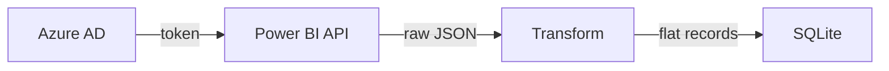

# BI Asset Monitoring — Power BI Metadata Ingestion

Pipeline that connects to the Power BI REST API, fetches report/dataset/workspace metadata, and upserts it into a local SQLite table (`bi_assets`).

## How to Run

```bash
pip install -r requirements.txt
cp .env.example .env          # fill in AZURE_TENANT_ID, AZURE_CLIENT_ID, AZURE_CLIENT_SECRET
cd src && python main.py
```

Requires an Azure AD app registration (service principal) with `Workspace.Read.All`, `Report.Read.All`, and `Dataset.Read.All` permissions, added as a Viewer to each target workspace.

### Demo mode

You can run the pipeline without Azure credentials using a local fixture:

```bash
cd src && python main.py --demo
```

This loads sample data from `tests/fixtures/sample_api_response.json`, runs it through the transform layer, and writes to a real SQLite database. Useful for reviewing the pipeline end-to-end without needing a cloud environment.

### Tests

```bash
pip install pytest
pytest tests/ -v
```

## Schema

```sql
CREATE TABLE IF NOT EXISTS bi_assets (
    asset_id        TEXT PRIMARY KEY,   -- Power BI report GUID
    asset_name      TEXT NOT NULL,
    workspace_id    TEXT,
    workspace_name  TEXT,
    dataset_id      TEXT,
    owner           TEXT,               -- dataset configuredBy (UPN); may be NULL
    last_refresh_at TEXT,               -- ISO 8601; endTime with startTime as fallback
    last_updated    TEXT,               -- dataset timestamp from API (when available)
    views_last_30d  INTEGER,            -- requires Admin API; NULL until connected
    last_viewed     TEXT,               -- requires Admin API; NULL until connected
    status          TEXT,               -- SUCCESS | FAILED | NEVER_REFRESHED | NOT_REFRESHABLE | NO_DATASET | REFRESH_UNKNOWN
    source_system   TEXT,               -- 'power_bi'
    ingested_at     TEXT NOT NULL
);
```

`views_last_30d` and `last_viewed` are not available from the standard Power BI REST API. They require the Admin API's activity log endpoint (`getActivityEvents`). The columns are included in the schema per the brief, ready to populate when the admin endpoint is connected.

## Pipeline Flow



## Architecture

- The script is designed to run on a schedule (for example via cron jobs). In a production setup, it could be integrated into an orchestrator like Dagster.

- Credentials are read from environment variables. In production, secrets would be managed in a service like Azure Key Vault, as is common practice for sensitive credentials in production environments.

- API calls include basic retry logic (3 attempts with backoff) for transient errors like 429 or 5xx. Errors on individual datasets (for example 403/404 on refresh history) are logged without stopping the whole pipeline. A global failure exits with code 1 so it can be picked up by a scheduler fast. 

- Data is stored in SQLite using an upsert on `asset_id`. This makes the pipeline idempotent, so running it multiple times produces the same result.

- The transformation step is separated from ingestion. It takes raw API responses and produces a clean, flat structure with one row per report.

- Deleted reports are not handled in this version. If a report is removed from Power BI, its last state remains in the table. In a production setup, I would add a monitoring script to detect and flag removed reports.

## Monitoring and Alerting

I would monitor the data using simple queries on the `bi_assets` table after each run, rather than embedding alerting directly in the pipeline:

- Reports with `status = 'FAILED'` should immediately alert for critical cases, and otherwise should be part of a daily summary

- Reports with `status = 'REFRESH_UNKNOWN'` often indicate a permissions issue or missing access.

- Reports with `status = 'SUCCESS'` but outdated `last_refresh_at` help detect refresh jobs that stopped running without failing.

- Reports with `status = 'NEVER_REFRESHED'` are useful to catch newly created reports where refresh was never configured

- Check `ingested_at`, if no data has been ingested recently, it likely means the pipeline has failed.

- Dashboard usage (view counts, unique viewers) is not available from the standard REST API. It requires the Admin API's activity log endpoint (`getActivityEvents`). The schema includes `views_last_30d` and `last_viewed` columns, ready to populate when that endpoint is connected. Once populated, monitoring for significant drops in usage (e.g. > 40% week-over-week) becomes possible.

## Design Decisions

I used a service principal (client credentials flow) rather than username/password because the pipeline shouldn’t break when someone changes their password or leaves the team, and this is how I have always worked in the past, as it is also easier for large scale production and easier for automations.

I picked SQLite because the upsert logic is standard SQL. The `INSERT ... ON CONFLICT` syntax works the same in Postgres. Redshift would need a `MERGE` or staging-table pattern instead. Moving to a different database would also mean swapping the `sqlite3` module for something like `psycopg2`, so it would not be just a one-line change, but the SQL logic and pipeline structure stay the same.